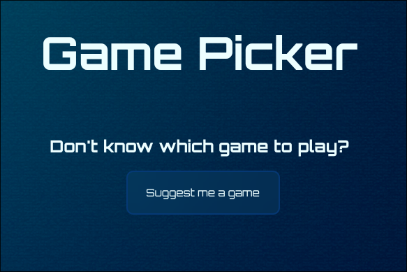

# Game Picker

A simple website that helps you decide what game to play when you can't choose.

## Preview



[Try it out](https://tejaswa10.github.io/game-picker/)

## Features

* Choose between **Competitive Games** and **Story Games**
* Randomly selects a game from the chosen category
* Try again to get another recommendation
* Simple glass-style interface
* Custom gaming-themed background
* Responsive viewport setup for different screen sizes

## Tech Stack

* **HTML** — Page structure and content
* **CSS** — Styling, layout, glass effects, hover animations, and background
* **JavaScript** — Button interactions, random game selection, DOM manipulation, and game-picker logic

## How It Works

1. Click **Suggest me a game**
2. Choose **Competitive Game** or **Story Game**
3. JavaScript randomly selects a game from the corresponding array
4. The selected game is displayed on the page
5. If you don't like the recommendation, click **Try again** to choose another one

## Project Structure

```text
game-picker/
├── index.html
├── style.css
├── script.js
├── images/
│   └── BG.jpg
├── screenshot.png
└── README.md
```

## Purpose

I built this project to practice JavaScript and learn how HTML, CSS, and JavaScript work together to create an interactive website.

The project helped me practice:

* JavaScript variables and arrays
* Functions and event listeners
* `if` statements
* DOM selection with `querySelector()`
* Changing webpage content with `textContent`
* Showing and hiding elements with JavaScript
* Generating random array indexes with `Math.random()` and `Math.floor()`

## Future Improvements

* Add more game categories
* Add game cover images to recommendations
* Add a smoother transition between sections
* Add more games to the lists
* Improve the interface for mobile screens

